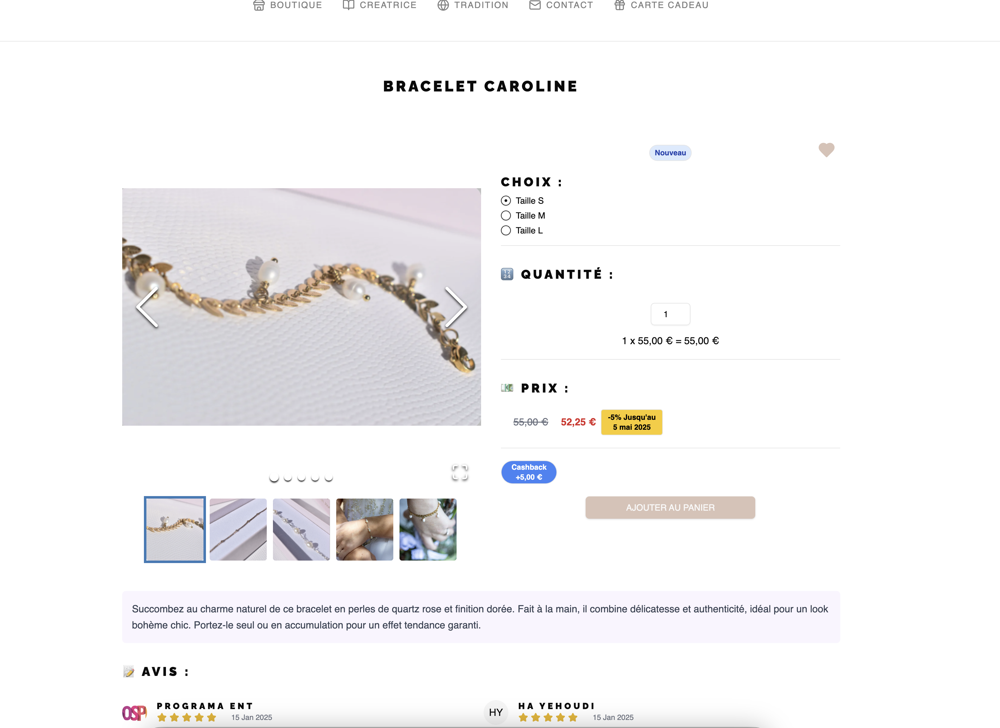
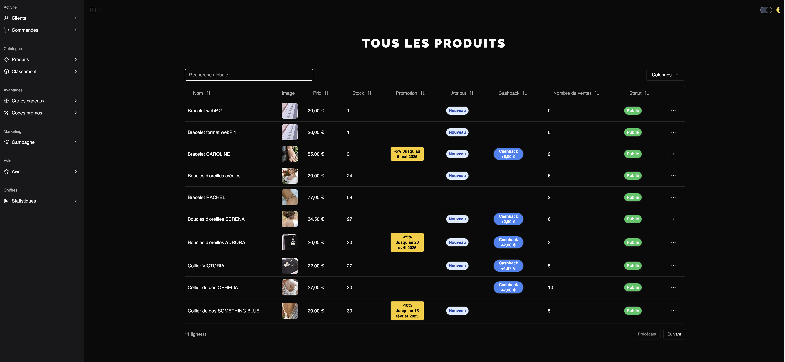
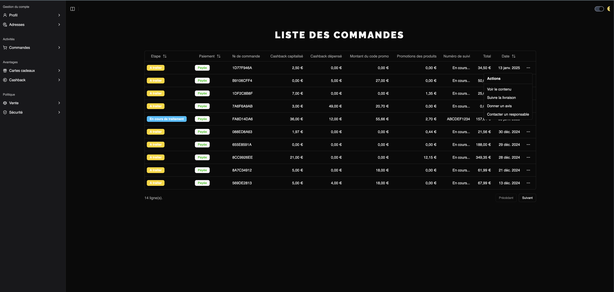

# E-commerce V3

## 🌆 ILLUSTRATIONS DU SITE

### Page d'accueil


### La boutique


### Fiche produit



### Ajout au panier (dark mode)


### Carte cadeau


### Tableau de bord admin



### Tableau de bord client



### Connexion par email et sécurisée par un token


## Instructions pour tester le site e-commerce

Le site est actuellement en préproduction. Vous pouvez explorer ses fonctionnalités et tester les différentes options, y compris le paiement en mode test avec Stripe. Voici les informations nécessaires pour effectuer vos essais :

---

### 🛒 **Codes promo disponibles**

- **Bonjour-20** : 20 % de réduction
- **Bonjour-30** : 30 % de réduction

---

### 🎁 **Utilisation des cartes cadeaux**

Les cartes cadeaux permettent :

- D’utiliser plusieurs cartes pour une même commande.
- D’utiliser seulement une partie du montant d’une carte.

**Codes de cartes cadeaux disponibles :**
| Code secret | Montant restant (€) |
|-------------------|---------------------|
| Su1pVXCeU6 | 19 |
| U9Xc18K57z | 17 |
| NTiUSqzsGj | 13 |
| iVHYh8MvZH | 20 |
| vJXtV4gsf2 | 21 |
| uvuqi93rI0 | 22 |
| OdbWBbgPGS | 23 |
| Hkvzbi8ytn | 24 |
| Ww9DDfmlnd | 25 |
| bVGk5gRZJH | 30 |

Vous pouvez également acheter des cartes cadeaux directement sur le site et les offrir.

---

### 💳 **Tester le paiement avec Stripe**

Le mode test est activé pour les paiements. Utilisez les informations suivantes :

| **Carte**         | **Numéro**           | **Code de sécurité (CVV)** | **Date d’expiration**          |
|--------------------|----------------------|-----------------------------|---------------------------------|
| 🟦 Visa            | 4242 4242 4242 4242 | 3 chiffres aléatoires        | Toute date postérieure à aujourd’hui |
| 🟧 Mastercard      | 5555 5555 5555 4444 | 3 chiffres aléatoires        | Toute date postérieure à aujourd’hui |
| 🟦 American Express| 3782 822463 10005    | 4 chiffres aléatoires        | Toute date postérieure à aujourd’hui |

#### Exemple pour simplifier :

- Numéro : **4242 4242 4242 4242**
- Date d’expiration : **04/44**
- CVV : **444**

---

### 💰 **Cashback**

En achetant certains produits, vous cumulerez du cashback utilisable lors de vos prochains achats.

---

N'hésitez pas à me signaler si vous relevez des bugs ou des incohérences lors de vos essais.

## 🛠️ DEVELOPPEMENT EN LOCAL

### CLIENT

1. **Démarrer l'application** :
   ```bash
   cd <client>
   npm run dev
   ```

### API

1. **Lancer l'émulateur de firebase** :
   ```bash
   cd <api/functions>
   npm run serve (firebase emulators:start --only functions)
   functions: Emulator started at http://127.0.0.1:5001/noralyapreprod/us-central1/api
   ```
2. **Interface de l'émulateur firebase** :

   ```bash
   http://127.0.0.1:4000/logs?q=metadata.emulator.name%3D%22functions%22

   ```

3. **Utilser cette adresse comme api** :
   ```bash
   cd <client>
   VITE_API_URL =http://127.0.0.1:5001/noralyapreprod/us-central1/api/api
   ```
   ⚠️ api/api

## 🚀 APPLICATION DEPLOY

### Preproduction

| **Côté**       | **Commandes**              |
| -------------- | -------------------------- |
| **Front side** | 1. `cd client`             |
|                | 2. `npm run build:preprod` |
|                | 3. `npm run deploy`        |
| **Back side**  | 1. `cd api/functions`      |
|                | 2. `npm run deploy`        |

### Production

| **Côté**       | **Commandes**                  |
| -------------- | ------------------------------ |
| **Front side** | 1. `cd client`                 |
|                | 2. `npm run build:production`  |
|                | 3. `npm run deploy:production` |
| **Back side**  | 1. `cd api/functions`          |
|                | 2. `npm run deploy:production` |

---

## 🌐 APPLICATION ADDRESSES

### Preproduction

- **Front side:** [noralyapreprod.web.app](https://noralyapreprod.web.app/)
- **Back side:** [API Endpoint](https://api-zcaf44vszq-uc.a.run.app/api)
